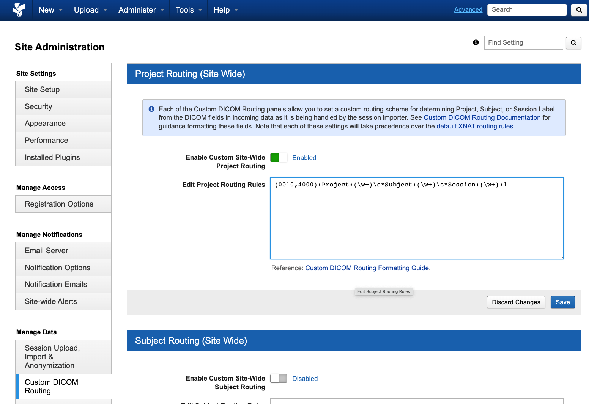
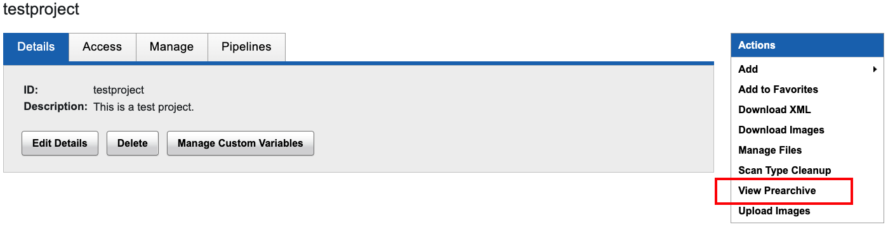

# Senior Clinical Scientist in AI - Interview Round #2
Congratulations on reaching round two of interviews for the role of Senior Clinical Scientist in Artificial Intelligence (AI) at Guy's and St Thomas' NHS Foundation Trust (GSTT) Clinical Scientific Computing (CSC) team :tada:

This round will test general technical skills relevant to the team and our work and is an opportunity for you to demonstrate your proficiency in programming, containerisation, databases, documentation, system design, and troubleshooting.

> [!IMPORTANT] 
> Please complete as many of the tasks as possible and do not spend more than 4 hours on the assignment. The deadline is **12PM BST on Monday, June 24th, 2024** i.e., we will review the version of your repositories as of that time.
>
> We will also send out meeting invites scheduled for later that Monday afternoon, so you have an opportunity to walk us through your work on this assignment.

> [!TIP]
> If in doubt, please write pseudo-code, comments in the code itself, and/or further details on your approach to these tasks in the Summary file so we can consider these as well.

## Pre-requisites
In order to successfully complete the tasks, you will need to have the following installed on your local machine:

- A code editor or integrated development environment (IDE), such as Visual Studio (VS) Code, PyCharm, etc.
- Docker
- `dcmtk`
  - This can be installed either in a Python virtual environment (see Setup below) or globally e.g., by running `brew install dcmtk` for MacOS, `apt-get install dcmtk` for (most) Linux systems, etc.
- `requests` 
  - This can be installed either in a Python virtual environment (see Setup below) or globally e.g., by running `pip install requests`

## Tasks

These are roughly divided into **Setup** and **Development**:

### Setup
These set of tasks are focused on general setup and familiarity with `git`, GitHub, Docker, etc.

#### General
- [ ] Clone this repository to your GitHub account.
- [ ] Rename the repository so that the initials of your first and last names are added as a suffix e.g., for "Jane Doe", it should be 196-LIS8437-JD.
- [ ] Grant the following users access to this renamed repository in your GitHub account so we can view the committed code, directory, file, etc. changes by the deadline.
  - [ ] [dangerdika](https://github.com/dangerdika)
  - [ ] [tomaroberts](https://github.com/tomaroberts)
  - [ ] [AnilMistry](https://github.com/AnilMistry)
  - [ ] [heyhaleema](https://github.com/heyhaleema)
- [ ] Create a Python virtual environment on your local machine to use for development in a `venv` directory i.e., `196-LIS8437-JD/venv/<your_virtual_environment>`.
- [ ] Create a `requirements.txt` file i.e., so you can add any packages that you have installed and use for development.
- [ ] Build the 196-LIS8437 Docker container by running `docker compose up -d --build` from the repository's root directory on your local machine.

#### XNAT
- [ ] Clone the [xnat-docker-compose](https://github.com/NrgXnat/xnat-docker-compose) repository to your local machine.
  - [ ] Set up XNAT by running the following your Terminal `cd xnat-docker-compose; mv default.env .env; docker compose up -d --build`.
  - [ ] Confirm this XNAT Docker container is running on your local machine by opening up http://localhost on a web browser and logging in with `admin` for both your username and password.
    - [ ] If this is your first time setting up XNAT on your local machine, you will also need to select "Save All" after logging in to complete the initial setup.
  - [ ] At the top of the homepage, select the **Administer** > **Site Administration** tab.
  - [ ] Select the **Custom DICOM Routing** in the lefthand sidebar (under the **Manage Data** subheader)
    - [ ] In the **Project Routing (Site Wide)** subsection, enter `(0010,4000):Project:(\w+)\s*Subject:(\w+)\s*Session:(\w+):1`, turn on "Enable Custom Site-Wide Project Routing", and save your changes.
          
  
##### Creating a project and pushing data to XNAT
We've created an XNAT project setup Python script i.e., `xnat/project_setup.py`, in this repository to create and push data into a project i.e., `testproject`.

> [!TIP]
> For one of Development tasks, you will need to extract any DICOMs from any one of the patients i.e., "subjects", in `testproject`, perform some transformations, and push it back to the same project. How you do so is fully up to you but if in doubt, we recommend taking a look at the script and its comments for some guidance.

To continue with the setup, you will now need to:

- [ ] Run the XNAT project setup Python script in `xnat/project_setup.py` to create the `testproject` and push data into it.
  - [ ] It may take a few minutes for the data to appear in the project, so you can check the log file generated in the `xnat/` directory and project's Prearchive on XNAT to see its progress.
        

> [!NOTE]
> In the unlikely event that an error is flagged in the project's Prearchive for any of the incoming subjects, you can delete the subject(s) and either (1) re-run the script or (2) continue without the subject(s). The key point here is that you have at least one subject and its DICOMs for the tasks ahead.

### Development
These set of tasks are focused on general development and familiarity with Python, scripting, Docker, Postgres, and XNAT. 

You are free to decide how the project is structured so long as there are functions, scripts, etc., that demonstrate your ability to:

- [ ] Update the existing `.gitignore` file so that Python virtual environments are **included** and the `dev-data/` directory (automatically created when you build the `196-lis8437` Docker container) is **excluded** from being pushed to GitHub.
- [ ] Write either (1) a SQL query that can be run in pgAdmin or an interactive shell session within the `postgres` container, or (2) a Python function that queries the tables in the PostgreSQL `csc` database and returns the `patient_id`, `order_id`, and `report_id` for patients who:
  - [ ] Are alive
  - [ ] Are 18 years old or above as of January 1st, 2024
  - [ ] Had a radiology order created between January 1st, 2024 and March 31st, 2024 (inclusive)
- [ ] Retrieve DICOMs from any one of the subjects in the `testproject` project on XNAT and:
  - [ ] Edit the DICOM tags so that:
    - [ ] The values in the Study Date (0008,0020), Acquisition Date (0008,0022), Instance Creation Date (0008,0012), and Content Date (0008,0023) are shifted by 11 days e.g., "20240101" should become "20240112".
    - [ ] The values in the Study Time (0008,0030), Acquisition Time (0008,0032), Instance Creation Time (0008,0013), and Content Time (0008,0033) DICOM tags are removed/replaced with a blank value.
    - Replace the value in the Study Description (0008,1030) DICOM tag with "This is a test study description."
  - [ ] Push these modified DICOM files back to XNAT so that they are either (1) stored under the same Subject, but with a different Session e.g., "GSTT000001" and "SessionA", respectively, or (2) stored under a different Subject with the same Session e.g., "GSTT000001_new" and "601205b7-00d2-445b-ba30-4719dcb3f8b7", respectively.
- [ ] Add Orthanc as a new service to the Docker compose file.

## Common issues
- On MacOS, you may find `.DS_Store` files can cause issues e.g., running the XNAT project setup script. In this case, refer to the log to find the filepath of the problematic `.DS_Store`, delete this file, and re-run the script.
